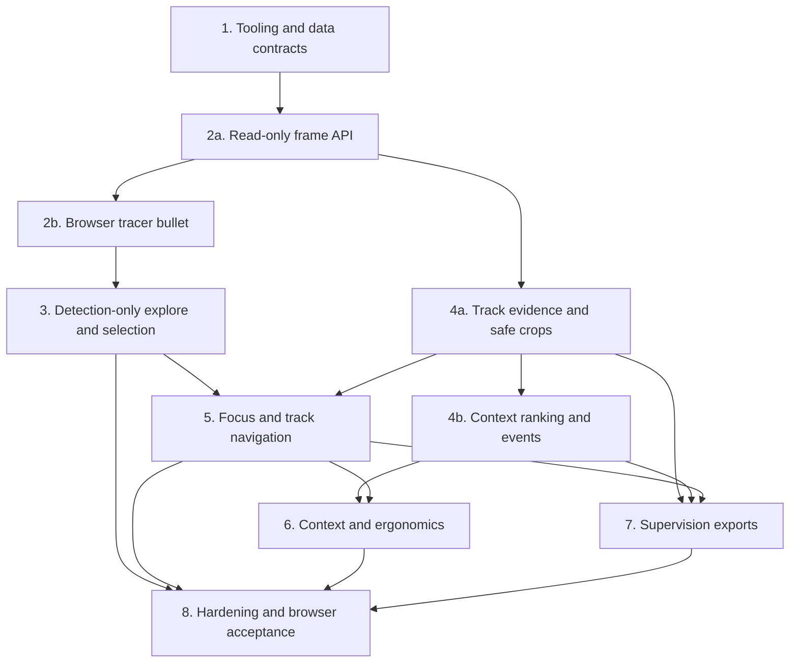

# Web-Based Dense Track Visualization Implementation Plan

Date: 2026-09-02

Status: Approved for implementation tracking

Origin: `docs/brainstorms/2026-09-02-web-track-visualization-requirements.md`

## Goal

Build a local, read-only FastAPI and React application for inspecting dense
MOT20 observations. The application starts from a clean frame, exposes overlap
ambiguity before selection, and progressively reveals only the evidence needed
to follow one sequence-local track.

The implementation must support two distinct local data conditions:

- `MOT20-06` and `MOT20-08` images paired with current `joco_v1` ten-field
  result files, where every track ID is `-1` and track features must be disabled.
- `MOT20-01` images paired with nine-field ground truth as a tracked development
  fixture, without describing its behavior as tracker quality.

The source images, ground truth, and tracker results remain immutable. All
generated caches, exports, and test artifacts go to explicit git-ignored
derived paths.

## Scope

### In scope

- A versioned Python application package and React/TypeScript client.
- Strict sequence, image, ground-truth, and tracker-result adapters.
- Enumerated frame and crop serving through FastAPI.
- A stacked-canvas frame viewer with a shared letterbox transform.
- Hover, candidate cycling, pinning, confirmation, and keyboard navigation.
- Explicit capability diagnostics when stable track IDs are unavailable.
- Sequence-scoped focus, context, timeline, filmstrip, search, and observation
  navigation for tracked inputs.
- Objective gap/lifespan summaries and disabled-by-default optional event
  detectors with visible thresholds.
- Deterministic shared browser/export track colors and bounded Supervision
  exports.
- Automated backend, frontend, and browser tests plus observed browser
  acceptance on representative dense frames.

### Out of scope

- Inferring identities for `joco_v1` rows whose ID is `-1`.
- Editing, correcting, splitting, merging, or relabeling tracks.
- Persisting reviewer decisions before a separate schema is approved.
- ReID similarity search, a database, WebSockets, or a spatial index.
- Long-running or asynchronous export infrastructure.
- Claims of held-out MOT20 test performance or official benchmark validity.

## Verified Baseline and Prerequisites

- No root Python package, JavaScript package, application build, or CI stack is
  currently established.
- Local Python is 3.12.3. The initial package will target Python 3.12 rather
  than claim compatibility with untested versions.
- Node.js is not currently installed. A supported Node.js LTS release and npm
  are an environment prerequisite before the frontend tracer bullet can run.
  Implementation must stop with `BLOCKED` rather than install system packages
  or use elevated privileges without user approval.
- `datasets/MOT20/test/MOT20-06/img1/` and `MOT20-08/img1/` are present locally,
  as are their `seqinfo.ini` files.
- `cvat/mot20_cvat/contracts.py` provides useful precedent for strict sequence
  enumeration, but it is CVAT-specific and rejects non-positive IDs. The viewer
  must not import it as its data layer because detection-only `-1` IDs are a
  supported viewer condition.
- Existing CVAT tests remain part of regression verification and the viewer
  must not change CVAT behavior.
- The application uses the repo-local `.venv/`, which is already git-ignored.
   Implementers may install only declared pinned Python dependencies into that
   environment. System-wide or elevated installs are `BLOCKED`; a dependency
   that cannot be resolved with available package access is also `BLOCKED`.
- Playwright browser installation requires network access and substantial local
   disk space. The frontend task must confirm that authority and capacity before
   downloading; it must report `BLOCKED` rather than silently omit browser tests.
- `artifacts/` is already git-ignored. The implementation must preserve and
   test that contract for viewer caches, exports, and screenshots. Frontend
   dependency and build-output ignores do not yet exist and Task 1 establishes
   them explicitly.

## Architecture Decisions

### Repository layout

Use these ownership boundaries:

```text
pyproject.toml                     Python package and test/lint configuration
Makefile                           Stable root verification and run commands
configs/viewer.toml                Repo-relative enumerated local sources
src/mot20/viewer/                  Contracts, indexes, API, cache, export logic
scripts/run_viewer.py              Thin local entry point
tests/viewer/                      Synthetic backend and contract tests
web/                               React/TypeScript/Vite application
web/src/                           UI, canvas, state, and API client
web/e2e/                           Playwright browser acceptance tests
docs/                              Operator and architecture documentation
artifacts/                         Ignored derived crops, exports, screenshots
```

The backend owns source enumeration, validation, indexes, feature capabilities,
and safe access to bytes. The browser owns all latency-sensitive interactive
rendering and hit testing. Offline exports use Supervision but share pure color
and geometry contracts with the browser.

### Configuration and startup

`configs/viewer.toml` enumerates only repo-relative source combinations. Each
entry names the sequence, `seqinfo.ini`/image root, annotation path, and adapter
kind (`mot_gt_9` or `mot_result_10`). It contains no machine-specific absolute
path and no writable source path. The default development entries are:

- `MOT20-01` with `datasets/MOT20/train/MOT20-01/gt/gt.txt`
- `MOT20-06` with `datasets/MOT20_TEST_TRACK_DEEPAK/joco_v1/dets/MOT20-06.txt`
- `MOT20-08` with `datasets/MOT20_TEST_TRACK_DEEPAK/joco_v1/dets/MOT20-08.txt`

Startup resolves each configured path below the repository root, rejects
escapes and symlink escapes, opens sources read-only, computes result hashes,
and constructs immutable sequence-scoped indexes. An absent configured path is
reported as unavailable and omitted from `/api/sequences`; a present but invalid
source is a startup error. Starting with zero available sources is valid and the
client presents an explicit empty state.

Each source may include a provenance block with producer, detector, checkpoint,
tracker, post-processing, adaptation iterations, and notes. Missing provenance
is a visible diagnostic, not invented metadata. Test-sequence sources are
classified as local test-adapted development material under `docs/MOTPolicy.md`.

### Normalized contracts

Represent each source row as an immutable observation containing:

- source key, sequence, one-based frame, source-row index, and source-row hash
- raw row values and result-file content hash
- raw track ID plus an optional usable track ID (`None` for sentinel-only rows)
- raw `(x, y, width, height)` and display-clamped `(x1, y1, x2, y2)`
- score, mark, class, and visibility only where their adapter defines meaning
- opaque tracker-result fields 8 through 10 without inferred semantics

The ground-truth adapter parses exactly nine fields and marks pedestrian rows
with `mark = 1` and `class = 1` as visible review observations while preserving
other parsed rows in source metadata. The tracker adapter parses exactly ten
fields and preserves the final three fields as opaque numbers. Both reject
non-finite or non-positive width/height, frames outside `1..seqLength`, and
boxes with no image intersection; partially out-of-bounds boxes remain valid,
retain raw coordinates, and clamp only for display/crops.

Capability diagnostics are derived from column distributions. Track-dependent
features require at least one valid positive ID and are disabled when the ID
column is absent, sentinel-only, or otherwise unusable. Empty frames remain
valid and are represented explicitly.

### API surface

Keep the initial REST surface small and sequence-scoped:

- `GET /api/health`
- `GET /api/sequences`
- `GET /api/sequences/{source_key}`
- `GET /api/sequences/{source_key}/frames/{frame}`
- `GET /api/sequences/{source_key}/frames/{frame}/observations`
- `GET /api/sequences/{source_key}/tracks/{track_id}`
- `GET /api/sequences/{source_key}/tracks/{track_id}/filmstrip`
- `GET /api/sequences/{source_key}/observations/{row_index}/crop`
- `POST /api/sequences/{source_key}/exports`

Frame and crop routes accept only startup-enumerated source keys, frame IDs,
and source-row IDs. Crop sizing and padding use bounded enums or validated
limits; clients never provide filesystem paths. Frames are immutable responses
with ETags and cache headers. Unsupported track routes return a typed capability
error rather than empty success.

### Initial interaction decisions

Resolve the requirements' open interaction choices as follows for the first
implementation:

- Implement Stage 0 before corrected tracker exports arrive, then reuse the
  same interaction path against `MOT20-01` for Stage 1.
- Require pin then confirm for every selection. Do not add a fast-confirm mode
  until observed use shows the extra confirmation is harmful.
- The wheel cycles candidates only while the pointer is over the canvas and a
  containing candidate set exists. `Tab`/`Shift+Tab` moves through candidate
  cards while pinned. Browser scrolling and tab behavior remain untouched in
  all other states.
- Candidate ordering is deterministic: containment, smallest area, normalized
  pointer geometry, edge distance, then source-row index. Hover hysteresis
  preserves the active candidate until movement exceeds a tested threshold or
  the reviewer explicitly cycles.
- When no box contains the pointer, Stage 0 reports no observation and does not
   offer a nearest-box fallback. Nearest boxes are optional in the requirements
   and are deferred until observed use shows a need; this avoids suggesting that
   geometric proximity identifies the intended person.
- Context mode defaults to three competitors and exposes a control from zero
  through a hard maximum of eight. The target-display browser review may lower
  the cap but must not raise it without another readability check.
- Implement objective lifespan and gap events first. Displacement, scale, and
  close-interaction detectors remain disabled by default; when enabled for
  evaluation, their box-height-normalized thresholds are visible in the UI.
- Do not add review-decision actions or storage in this plan.

### Testing and browser evidence

Ordinary tests use generated `seqinfo.ini`, tiny JPEG fixtures, and synthetic
9/10-field rows. Dataset smoke checks use local MOT20 files but never write
under `datasets/`. Frontend logic tests cover transforms, ranking, hysteresis,
state transitions, caches, and keyboard handling. Playwright covers full user
flows against a deterministic synthetic source and captures screenshots at
desktop and narrow viewports.

At each visible milestone, the orchestrator starts the real application,
checks the browser console and network failures, and observes the workflow in a
browser. Final acceptance includes user visual feedback. Automated screenshots
support this loop but do not replace human observation.

## Implementation Strategy

Use a hybrid breakdown. Task 1 creates the horizontal data and tooling
foundation that every feature requires. Tasks 2b, 3, 5, 6, and 8 are vertical,
browser-observable slices. Tasks 2a, 4a, 4b, and 7 isolate backend-heavy work so
Implementer agents do not need the full frontend context. The final breakdown
contains ten medium-sized packets.

Each task is intended for one bounded Implementer invocation. The orchestrator
provides only the origin section, this task section, owned/forbidden files,
current dependency outputs, and exact checks. Agents must not load unrelated
CVAT, tracker, or evaluation code. The orchestrator inspects every diff and
reruns the task's primary check before unblocking dependents.

Only Tasks 1, 2b, 4a, and 8 may edit dependency manifests, and each has a
disjoint purpose: Python bootstrap, frontend bootstrap, the first Supervision
pin, and final verified dependency repair. No other task adds a dependency; it
returns the need to the orchestrator. Task 1 creates all planned Make target
names, and later owners replace only their assigned target bodies.

## Task 1: Establish Tooling and Strict Data Contracts

**Objective:** Create the reproducible Python foundation and prove both local
MOT formats can be normalized without losing identity or coordinate evidence.

**Owned paths:** `.gitignore`, `pyproject.toml`, `Makefile`, `configs/viewer.toml`,
`src/mot20/__init__.py`, `src/mot20/viewer/config.py`, `contracts.py`,
`loaders.py`, `indexes.py`, and matching `tests/viewer/` files.

**Forbidden paths:** `datasets/**`, `cvat/**`, frontend files, and export code.

**Work:**

1. Establish Python 3.12 packaging, pytest, committed lint/type-check settings,
   and stable root commands. Limit pytest to `tests/` and exclude `repos/`,
   `cvat/`, `datasets/`, `web/`, and `artifacts/` from pytest, lint, and type
   discovery. Do not migrate CVAT unittest discovery. Select and pin FastAPI,
   Uvicorn, HTTPX for API tests, and all other direct backend-bootstrap
   dependencies in the lockable manifest. Create `test`,
   `test-backend`, `test-frontend`, `lint`, `lint-backend`, `build`,
   `build-frontend`, `e2e`, `smoke-local`, and `run` targets; implement the
   Task 1 targets and make future targets fail explicitly as not yet available.
2. Parse TOML with an explicit validated configuration model and resolve only
   enumerated repo-relative paths below the repository root. Support the
   optional incoming-source provenance block and diagnose missing fields.
3. Implement immutable sequence, observation, capability, and diagnostic
   models plus exact nine-field and ten-field adapters.
4. Validate `seqinfo.ini`, exact JPEG names/count/dimensions, row counts and
   numeric finiteness, frame range, geometry, source hashes, sentinel columns,
   and empty frames.
5. Build sequence-scoped frame and optional track indexes. Never place sentinel
   IDs into the usable track index.
6. Add synthetic tests first for valid adapters, malformed rows, traversal and
   symlink escape, partial border boxes, fully external boxes, empty frames,
   duplicate/source-row identity, sentinel-only IDs, and sequence isolation.
7. Add read-only smoke tests for the three configured local sources, marked so
   ordinary tests remain independent of local datasets.
8. Test absent configured datasets, present-invalid datasets, and an empty
   source registry. Preserve the existing `.venv/` and `artifacts/` ignores;
   establish and test ignores for `web/node_modules/`, `web/dist/`, Playwright
   browser/report output, and other generated frontend test artifacts.

**Acceptance:** Loading `MOT20-01` reports tracked capability; loading current
06/08 `joco_v1` reports detection-only capability and never invents identities.
Raw rows and raw boxes remain recoverable while display boxes are clamped.
Root test/lint collection does not enter third-party, CVAT, dataset, frontend,
or artifact trees.

**Focused verification:** `make test-backend`, `make lint-backend`, then the
explicit local-data smoke command introduced by this task. Re-run existing
`python3 -m unittest discover -s cvat/tests -v` as a regression check.

## Task 2a: Build the Read-Only Frame and Metadata API

**Depends on:** Task 1

**Objective:** Serve exact enumerated frame bytes, observations, capabilities,
hashes, policy classification, and provenance through a local-only API.

**Owned paths:** `src/mot20/viewer/api.py`, `server.py`,
`scripts/run_viewer.py`, matching backend API tests, and the assigned backend
Make target bodies.

**Forbidden paths:** Source datasets, frontend files, track evidence, crops,
events, and exports.

**Work:**

1. Add the health, sequence-list, sequence-detail, exact-frame, and frame-
   observation routes with final Stage 0 typed payloads, capability diagnostics,
   source hash, source class, and supplied provenance.
2. Serve frames from the startup enumeration only, with media type, immutable
   cache policy, ETag, conditional request handling, and frame-range errors.
   Filesystem reads must not block the event loop; use synchronous endpoints or
   an explicit threadpool and prove a delayed frame read does not delay a
   concurrent metadata request, using synchronization plus a one-second safety
   timeout.
3. Bind to `127.0.0.1` by default. Any wider host requires an explicit flag and
   startup warning. Permit CORS only from the configured Vite development origin
   in development, permit no cross-origin requests in production static mode,
   and validate `Host` against an allowlist. Test each boundary.
4. Return a typed empty registry when no sources are available and typed errors
   for unknown source keys, out-of-range frames, stale hashes, and unsupported
   track capabilities.
5. Mount a built frontend only from the fixed repository build directory when
   `web/dist/` exists; otherwise retain API-only startup. Define extension
   router registration in the application factory so later track/context/export
   routers register without redesigning server startup. The browser task writes
   the build directory but does not modify backend mounting behavior.

**Acceptance:** Synthetic and local `MOT20-01` first/middle/last frame bytes
match exact one-based source JPEGs, conditional requests work, and metadata
reports source hash/provenance/policy without exposing a client-supplied path.
The API is loopback-only by default and remains responsive during a delayed
frame read.

**Focused verification:** `make test-backend`, `make lint-backend`, an explicit
`curl` of local `MOT20-01`, and negative Host/CORS checks against a running app.

## Task 2b: Deliver the Exact-Frame Browser Tracer Bullet

**Depends on:** Task 2a

**Objective:** Establish the frontend toolchain and prove the complete browser
path from source selection to a correctly letterboxed exact frame.

**Owned paths:** `web/package.json`, lockfile, Vite/TypeScript/Vitest/Testing
Library/Playwright configuration, all initial `web/src/` shell/API/viewport
files and tests, frontend build output configuration, and assigned frontend
Make target bodies.

**Forbidden paths:** Data contracts, backend API semantics, source datasets,
track UI, filmstrip, events, and exports.

**Work:**

1. Confirm Node.js LTS and npm are available. Confirm authority before any
   Playwright browser download; return `BLOCKED` if prerequisites are absent.
2. Establish React, TypeScript, Vite, Vitest, Testing Library, and Playwright
   with committed npm lock data. Configure development proxying and production
   static mounting without duplicating API semantics.
3. Build the actual viewer shell as the first screen: source selector, exact
   one-based frame control, canvas viewport, minimal transport/error states,
   visible source hash/capability/provenance status, and a zero-source empty
   state. Test-derived sequences carry a persistent non-dismissible label that
   says they are local test-adapted development material, not held-out results.
4. Implement one shared image-to-screen transform and inverse that accounts for
   letterboxing, CSS size, and device-pixel ratio. Draw the JPEG only on the
   lower canvas; reserve the upper canvas for overlays.
5. Add pure transform tests and one Playwright tracer test
   that selects a source, seeks an exact frame, and asserts a nonblank correctly
   proportioned canvas. Assert the MOTPolicy label on a test source.

**Acceptance:** A browser can render exact first/middle/last frames from the
synthetic fixture and local `MOT20-01`, and seeking never introduces zero-based
or filename ambiguity. Resize preserves image aspect ratio and inverse mapping;
test-source policy status, provenance diagnostics, and hashes stay visible.

**Focused verification:** `make test-frontend`, `make build-frontend`, and the
tracer Playwright spec. Start the app and inspect
desktop and narrow viewport screenshots plus console/network state.

## Task 3: Complete Detection-Only Explore and Selection

**Depends on:** Task 2b

**Objective:** Complete Stage 0 against dense `joco_v1` frames while keeping all
track-dependent controls explicitly unavailable.

**Owned paths:** Frontend canvas overlay, playback/navigation, candidate
ranking, magnifier, chooser, selection state, cache/prefetch utilities,
controls, and their unit/browser tests.

**Forbidden paths:** `src/mot20/viewer/**`, backend tests, track index semantics,
context ranking, event heuristics, exports, and persisted decisions.

**Work:**

1. Keep all current-frame observations as browser hit regions while drawing no
   persistent boxes in Explore mode.
2. Implement `requestAnimationFrame` overlay redraw, stable hover ranking,
   hover hysteresis, current-candidate outline, and a bounded magnified crop.
3. Implement wheel cycling over the canvas and temporary all-box reveal while
   a dedicated non-conflicting key is held. Document and test the chosen key.
4. Implement first-click pause/pin, frozen candidate set, deterministic numbered
   outlines, a chooser showing at most five cards at once, scroll/keyboard
   access to every candidate, card-to-box focus, and candidate crops available
   for detection-only rows. Stage 0 cards show the current crop only because
   sentinel-ID observations have no valid earlier/later identity.
5. Implement second click/card click/`Enter` confirmation, `Escape` cancellation,
   and click-elsewhere reselection. When usable IDs are absent, confirmation
   remains a confirmed observation and the UI explains why Follow is disabled.
6. Add frame steps of 1 and 10, directional playback/scrub prefetch,
   `createImageBitmap` decoding where supported, and a bounded bitmap LRU that
   initially holds 150 frames, remains configurable within 100 through 200, and
   closes evicted bitmaps.
7. Test empty frames, no containing box, up to seven overlaps, more than five
   candidates, deterministic ties, edge coordinates, resize during pinning,
   keyboard focus, source switching, and disabled track actions.

**Acceptance:** With the pointer off-canvas in Explore mode, the overlay draw
plan issues zero stroke operations and the overlay is pixel-empty in Playwright.
On the densest available 06/08 frame, all overlapping candidates remain
reachable, pin/confirm behavior is deterministic, and no action implies a
stable track exists.

**Focused verification:** Frontend unit tests and Stage 0 Playwright flows,
followed by observed browser checks on `MOT20-06` and `MOT20-08` including an
ambiguous click and keyboard-only confirmation.

## Task 4a: Build Track Evidence, Filmstrip, and Safe Crops

**Depends on:** Task 2a

**Objective:** Provide bounded sequence-local track evidence for `MOT20-01`
without changing the interactive browser rendering contract.

**Owned paths:** Backend track/color/filmstrip/crop services and routes plus
their application-factory registration,
Supervision detection adapter, `docs/filmstrip-sampling.md`, matching
backend tests, and Supervision/Pillow dependency additions to `pyproject.toml`.

**Forbidden paths:** Frontend UI, source files, export endpoints, and decisions.

**Work:**

1. Expose sequence-local track lookup, first/last observation, exact observation
   frames, gaps, previous/next observations, and search by exact track ID.
2. Define deterministic browser/export track color values from sequence and
   track ID in a pure contract with language-neutral golden vectors.
3. Select and pin compatible Supervision and Pillow releases at first use,
   record why those versions are compatible, and add an adapter for filtering
   normalized detections by tracker ID. Do not use Supervision to render
   interactive frame responses.
4. Implement a deterministic filmstrip sampler capped at 64 observations that
   always includes current and representative endpoint/earlier/later evidence.
   Document the exact temporal sampling rule in the owned viewer document.
5. Serve bounded crops by source-row identity. Preserve raw coordinates in
   metadata, clamp pixels only at render time, and cache under a result/source
   hash and crop-parameter key in `artifacts/cache/` using atomic writes.
   JPEG decode, crop, and encode must use a synchronous endpoint or threadpool,
   never the event loop.
6. Test sequence isolation, missing track capability, track not found, gaps,
   boundary observations, sampling caps, cache invalidation, traversal attempts,
   and concurrent duplicate crop requests. With a crop operation held by a test
   barrier, require a metadata request to complete before release with a
   one-second safety timeout.

**Acceptance:** `MOT20-01` track requests return exact, deterministic evidence;
06/08 reject those requests with typed capability diagnostics. No cache key can
outlive changed source content or write outside the derived root.

**Focused verification:** Backend tests and lint/type checks, plus a read-only
smoke query for one gapped and one continuous `MOT20-01` track.

## Task 4b: Build Context Ranking and Optional Events

**Depends on:** Task 4a

**Objective:** Compute deterministic, bounded competition and optional motion
evidence without coupling those algorithms to frontend state.

**Owned paths:** Backend context/event services and routes plus application-
factory registration, focused tests, and configuration fields.

**Forbidden paths:** Frontend files, dependency manifests, crop/export code,
source files, and persisted decisions.

**Work:**

1. Rank context competitors over a bounded temporal window using IoU and
   box-height-normalized edge proximity. Return stable ranked evidence and all
   values needed for the client count control and hysteresis.
2. Implement optional displacement, scale-change, and close-interaction event
   calculations with explicit box-height-normalized thresholds and deterministic
   tests. Gap/lifespan summaries remain unconditional; heuristic events remain
   disabled by default.
3. Add low-confidence timeline evidence only when the adapter exposes meaningful
   confidence semantics and the source distribution is non-sentinel/nonconstant.
   The threshold is explicit and visible; ground-truth visibility is not silently
   relabeled as tracker confidence.
4. Test sequence boundaries, gaps, context ties, cap enforcement, normalized
   geometry, exact threshold boundaries, disabled behavior, and typed capability
   rejection for sentinel-only sources. Test meaningful, constant, absent, and
   sentinel confidence columns independently.

**Acceptance:** Identical source hashes and settings produce identical context
and event results, heuristic events never appear unless enabled, and no result
crosses a sequence boundary.

**Focused verification:** Focused backend context/event tests followed by full
backend test, lint, and type-check gates.

## Task 5: Deliver Focus Mode and Track Navigation

**Depends on:** Tasks 3 and 4a

**Objective:** Turn a confirmed tracked candidate into a quiet, frame-accurate
focus workflow with direct temporal evidence navigation.

**Owned paths:** Frontend track API types/client, focus state, focus overlay,
timeline, filmstrip, search, observation/event navigation, and tests.

**Forbidden paths:** Backend algorithms, context UI, exports, and decisions.

**Work:**

1. Enter Focus mode only after confirmation of a usable sequence-local track;
   reset all track state on source changes and reject stale hash responses.
2. Draw only the selected track with its stable strong color, ID, box, and
   bounded short motion trace. At a gap, show prior/next observation evidence
   without pretending there is a current box.
3. Add previous/next observation and previous/next gap navigation plus one-based
   frame steps. Every action seeks the exact source JPEG frame.
4. Build an accessible timeline with first/last observation, gaps, and enabled
   optional events, including low-confidence observations only when the backend
   marks confidence meaningful. Show thresholds for threshold-dependent layers.
5. Build the bounded crop filmstrip with documented sampling, current/earlier/
   later evidence, loading/error states, and exact-frame seeking.
6. Enrich pinned candidate cards for tracked sources with current, representative
   earlier, and representative later observation crops; retain current-only
   cards for detection-only sources.
7. Add exact sequence-local track-ID search and explicit no-result/capability
   states. `Escape` exits focus back to the clean Explore frame.
8. Add previous/next enabled-event navigation alongside previous/next
   observation and gap navigation; skip disabled event families deterministically.
9. Test gaps, low-confidence capability and markers, stale requests during rapid
   seek/source switch, missing crops, filmstrip cap, keyboard navigation,
   previous/next enabled-event navigation, timeline marker seeking, and focus
   exit.

**Acceptance:** A selected `MOT20-01` identity remains stable across observations
and gaps, every evidence action seeks the correct frame, and switching to 06/08
cannot leak or recreate the prior selection.

**Focused verification:** Frontend tests and Focus-mode Playwright flows,
followed by observed browser review of one continuous and one gapped track.

## Task 6: Deliver Context Mode and Review Ergonomics

**Depends on:** Tasks 4b and 5

**Objective:** Add restrained local competition evidence without restoring the
visual overload that the viewer is intended to remove.

**Owned paths:** Frontend context controls/state/overlays, event controls,
accessibility and responsive styling, and their tests.

**Forbidden paths:** Ranking algorithm redesign, export rendering, persistence,
source mutation, all backend files, and dependency manifests. A missing response
field returns to the orchestrator, who reopens Task 4b.

**Work:**

1. Add a Focus/Context segmented control and context-count control with default
   three, range zero through eight, and the focal track visually dominant.
2. Draw context observations as thin corner markers using shared track colors.
   Apply client hysteresis over backend rankings to prevent frame flicker.
3. Expose optional event toggles and threshold controls only for implemented
   detectors. Keep all heuristic events disabled by default and distinguish
   them visually from objective gaps.
4. Make chooser, timeline, filmstrip, playback, and context controls usable by
   keyboard with coherent focus order and no browser shortcut conflicts. Give
   the chooser list/option semantics with `aria-activedescendant`, announce the
   candidate count and disabled Follow reason through a polite live region, use
   visible non-color focus indicators, and honor `prefers-reduced-motion` for
   playback and traces. Shape and stroke weight, not color alone, distinguish a
   focal full box/label/trace from context corner markers.
5. Validate responsive dimensions so canvases, cards, labels, and controls do
   not overlap on target desktop and narrow viewports.
6. Test context caps, hysteresis across rank changes, focal dominance, event
   toggles, keyboard-only tracked review, and responsive layout.

**Acceptance:** At default context count on the densest `MOT20-01` frame, context
ink covers no more than 5% of focal-box area, focal stroke is strictly wider
than every context stroke, and no context marker intersects the focal ID-label
rectangle, asserted on the draw plan. The user reviews three versus lower counts
on the target display; any cap change is recorded before Task 8.

**Focused verification:** Frontend tests and Context-mode Playwright flows,
then user-observed browser comparison at dense `MOT20-01` frames.

## Task 7: Add Bounded Supervision Exports and Render Parity

**Depends on:** Tasks 4a, 4b, and 5

**Objective:** Determine whether bounded synchronous clips or offline per-track
videos satisfy common review needs while preserving browser/export identity.

**Owned paths:** Backend export service/route/models and application-factory
registration, export CLI if needed, Supervision rendering integration, derived
artifact metadata, and export tests.

**Forbidden paths:** Asynchronous jobs, queues, source mutation, and frontend
interaction redesign.

**Work:**

1. Render focal boxes/labels/traces and context corners through pinned
   Supervision annotators using the same color vectors and geometry as canvas.
2. Add synchronous focused clip export capped at 300 frames and an offline
   per-track video command. Reject larger interactive requests with guidance to
   the offline command. The export route rejects an `Origin` other than the
   configured application origin.
3. Write outputs atomically under a hash-keyed `artifacts/exports/`
   directory with source/result hashes, frames, track, parameters, tool version,
   incoming producer/detector/checkpoint/tracker/adaptation provenance, and
   local test-adapted classification in sidecar metadata.
4. Compare browser and export output on a representative golden frame using
   stable semantic/pixel tolerances, including selected color and box placement.
5. Test bounds, capability rejection, stale-hash invalidation, collisions,
   partial failures, and preservation of existing artifacts.
6. Exercise one short focused clip and one offline per-track video, then record
   whether either can replace part of the interactive review workflow.

**Acceptance:** Browser and export colors identify the same track, output never
overwrites an existing artifact, and every export is reproducible from metadata.

**Focused verification:** Export unit/integration tests, representative render
comparison, structural video inspection, and observed playback of bounded
outputs. Do not claim codec support that was not exercised locally.

## Task 8: Harden Performance, Documentation, and Browser Acceptance

**Depends on:** Tasks 3, 5, 6, and 7

**Objective:** Close the implementation with measured dense-frame behavior,
operator documentation, and a fresh end-to-end browser/user acceptance loop.

**Owned paths:** Cross-layer integration tests, performance instrumentation,
Playwright suites/screenshots, `docs/`, root run/verification commands,
and required updates to `.claude/project/docs-index.md`, `repo-map.md`, and
`verification.md`.

**Forbidden paths:** New product features, review-decision persistence, model
training, and source/result changes.

**Work:**

1. Measure from each `pointermove` event timestamp through the end of the
   `requestAnimationFrame` callback that draws the resulting highlight,
   including hit testing, ranking, hysteresis, and overlay drawing. Collect at
   least 1,000 post-warm-up samples on the densest 06/08 frame in each of three
   runs. Require p95 below 50 ms in every run and record p50/p95, CPU, RAM, OS,
   browser/version, display resolution, and device-pixel ratio.
2. If the threshold fails, profile and optimize within the current architecture.
   After two profiling-and-optimization iterations, stop and report the numbers
   and profile; ask whether to relax the criterion or authorize an architecture
   change. Never narrow the measured span to obtain a pass.
3. Record cold- and warm-cache seek-to-rendered-frame p95 as observed budgets.
   Verify bounded bitmap/crop caches, directional prefetch, ETags, explicit
   bitmap release, rapid scrub cancellation, and bitmap-count/heap ceilings
   over a 500-frame scrub; the origin sets no pass threshold for seek latency.
4. Add complete Playwright journeys for detection-only ambiguity and tracked
   focus/context review at desktop and narrow viewports. Check screenshots,
   nonblank canvas pixels, console errors, failed requests, text fit, and
   overlay alignment. Run automated accessibility scans on Explore, pinned
   chooser, and Focus states; require zero serious/critical violations or
   document each exception for user acceptance.
5. Document setup, Node/Python prerequisites, configuration, source formats,
   run/test/build commands, keyboard controls, capability diagnostics, derived
   paths, export provenance, known limitations, and MOT20 policy language.
   Replace Task 1's aggregate `test`, `lint`, and `build` Make stubs and the
   frontend `e2e` stub with final composed command bodies; earlier tasks edit
   only their explicitly assigned backend/frontend target bodies.
6. Run the full backend/frontend/build/browser gates and existing CVAT tests.
   Inspect the final diff for generated-artifact changes. Record SHA-256 values
   for every configured source file before and after the full acceptance run and
   require equality because ignored dataset files are invisible to Git diff.
7. Start the application on an available local port and complete the final
   human loop: detection-only seek/hover/cycle/pin/confirm on 06/08; tracked
   search/focus/gap/timeline/filmstrip/context on 01; and export playback.
8. Present the running URL and evidence to the user, collect visual feedback,
   fix acceptance defects in the owning prior task, and rerun affected checks.
9. If corrected 06/08 tracker exports are still unavailable, document that Stage
   1 has only ground-truth-fixture evidence and no real tracked-result evidence;
   do not present the release candidate as validated on corrected tracker output.

**Acceptance:** All success criteria in the origin requirements have either
fresh evidence or an explicit documented limitation. The full browser workflow
has been observed by the orchestrator and user, source files are unchanged, and
no console/network/layout errors remain in accepted viewports.

**Focused verification:** Stable root `make test`, `make lint`, `make build`,
and `make e2e` commands established by the implementation, existing CVAT unit
tests, local-data smoke checks, performance report, final browser observation,
and `git status --short --branch`.

## Dependency Graph



Tasks 2b and 4a may run concurrently after Task 2a because they own frontend and
backend surfaces respectively. Task 3 may continue in parallel with 4a/4b but
cannot edit backend files. All other execution is dependency-driven. The
orchestrator integrates and verifies any manifest or API-contract change before
launching a dependent agent; concurrent writers never share an owned path.

## Milestones

- **Stage 0 complete after Task 3:** detection-only review works on current
  06/08 results and track features are explicitly disabled.
- **Stage 1 complete after Task 6:** tracked selection, evidence, and restrained
  context work against `MOT20-01` and are ready to revalidate against corrected
  06/08 exports when those arrive.
- **Stage 2 complete after Task 7:** bounded export is available and its value
  relative to interactive review has been observed.
- **Release candidate after Task 8:** performance, documentation, regression,
  browser, and user visual acceptance evidence is fresh.

## Orchestrator Protocol

For every child task:

1. Confirm dependencies are closed and inspect shared-worktree changes.
2. Supply the Implementer only that task's objective, owned/forbidden paths,
   origin requirements, verified assumptions, invariants, and exact checks.
3. Require test-first work for contracts, state machines, security boundaries,
   cache behavior, and bugs; require a tracer or characterization test for
   browser/canvas behavior before broad implementation. Toolchain bootstrap is
   the sole exception: install and configure the runner first, then add the
   tracer test immediately before product logic.
4. Reject architecture expansion, dataset mutation, invented metrics, unrelated
   cleanup, or implementation outside the task packet.
5. Inspect changed files and diagnostics, rerun the narrow acceptance check,
   and perform the stated browser observation before accepting user-visible work.
6. Record discovered durable work as a separate Beads issue only when it is
   genuinely outside the approved task and necessary to preserve for later.
7. Close the child with concise verification evidence; do not describe a child
   completion as repository completion.

## Risks and Mitigations

- **Missing Node runtime:** Blocks Task 2b onward. Detect before delegation and
  ask the user to install a supported LTS release rather than attempting sudo.
- **Corrected exports change assumptions:** Content hashes and startup
  diagnostics prevent stale state. Re-run Stage 1 and 2 acceptance on 06/08;
   do not redesign adapters unless the producer contract actually differs. Until
   then, tracked interactions have ground-truth-fixture evidence only.
- **Crowd ambiguity:** Confirmation, complete candidate access, deterministic
  ranking, and keyboard cycling prevent ranking from becoming hidden truth.
- **Frame/coordinate drift:** One-based typed routes, one transform/inverse,
  golden vectors, and border-box tests guard identity and geometry contracts.
- **Browser/export disagreement:** Shared color vectors, raw/display geometry
  separation, and representative render comparison make disagreement visible.
- **Memory growth:** Explicit bitmap closure, bounded browser/crop caches,
  cancellation, and repeated-navigation measurement precede optimization.
- **Source or artifact loss:** Read-only sources, containment checks, hash-keyed
  derived roots, atomic writes, and no-overwrite exports protect evidence.
- **Misleading evaluation language:** UI/docs identify source type and hash;
  all test-adapted work follows `docs/MOTPolicy.md`.

## Beads Issue Creation

After final plan approval, use actor `copilot:web-track-visualization` on every
write. Create one P1 epic titled **Build dense MOT20 web track viewer**, labeled
`viewer,tracking`, with
`--spec-id docs/plans/2026-09-02-web-track-visualization.md`. Create these flat
children with `--parent <epic-id>`; each child uses the same spec ID and its task
section as the description/design and acceptance source.

| Key | Child title | Type | Priority | Labels |
| --- | --- | --- | --- | --- |
| T1 | Establish viewer tooling and strict data contracts | task | P1 | `viewer,dataset` |
| T2A | Build read-only frame and metadata API | feature | P1 | `viewer,dataset` |
| T2B | Deliver exact-frame browser tracer bullet | feature | P1 | `viewer` |
| T3 | Complete detection-only explore and selection | feature | P1 | `viewer,tracking` |
| T4A | Build track evidence, filmstrip, and safe crops | feature | P1 | `viewer,tracking` |
| T4B | Build context ranking and optional events | feature | P2 | `viewer,tracking` |
| T5 | Deliver focus mode and track navigation | feature | P1 | `viewer,tracking` |
| T6 | Deliver context mode and review ergonomics | feature | P2 | `viewer,tracking` |
| T7 | Add bounded Supervision exports and render parity | feature | P2 | `viewer,tracking,evaluation` |
| T8 | Harden performance, documentation, and browser acceptance | task | P1 | `viewer,tracking` |

After capturing the returned IDs, add only these blocking edges with
`bd dep add <dependent> <prerequisite> --actor
"copilot:web-track-visualization"`:

```text
T2A <- T1
T2B <- T2A
T3  <- T2B
T4A <- T2A
T4B <- T4A
T5  <- T3
T5  <- T4A
T6  <- T4B
T6  <- T5
T7  <- T4A
T7  <- T4B
T7  <- T5
T8  <- T3
T8  <- T5
T8  <- T6
T8  <- T7
```

Use `--validate` when creating every issue. After the epic exists, dry-run the
first child with `--validate --dry-run` and inspect its schema result before
creating any child; adjust only issue-field formatting if Beads requires named
description sections. Then run `bd dep tree <epic-id>`, `bd lint`, `bd orphans`,
and `bd export -o .beads/issues.jsonl`. Do not claim or start implementation
issues during planning, and do not commit or sync Beads.

## Plan Review Gate

Before creating implementation issues, independently review this plan with
`claude-opus-5` at medium reasoning effort. The review must check requirement
coverage, slice size and agent context cost, ownership overlap, dependency
correctness, API/data/security contracts, testability, performance evidence,
and browser acceptance. Resolve every actionable finding in this document and
record the final verdict and material changes below. Create the Beads epic and
children only after the review gate passes.

## Review Record

### First pass

- Reviewer: GitHub Copilot CLI 1.0.79, `claude-opus-5`, medium reasoning
- Verdict: **APPROVE WITH CHANGES**
- Material resolutions: split oversized Tasks 2 and 4; removed concurrent
   backend ownership; added loopback/Host/CORS/Origin controls; specified local
   environments and collection exclusions; handled absent datasets; added
   source provenance and MOTPolicy labeling; made performance, accessibility,
   visual quietness, async I/O, and source immutability checks falsifiable;
   restored tracked candidate crop and filmstrip traceability; corrected export
   dependencies; bounded optimization retries; and defined exact Beads children.

### Second pass

- Reviewer: GitHub Copilot CLI 1.0.79, `claude-opus-5`, medium reasoning
- Verdict: **APPROVE WITH CHANGES**
- Material resolutions: assigned FastAPI/Uvicorn/HTTPX and image-processing
   dependency pins; restored meaningful low-confidence timeline evidence and
   previous/next enabled-event navigation; corrected frontend ignore-rule facts;
   named `web/dist/`; assigned extension-router registration and aggregate Make
   targets; fixed the initial bitmap-cache size; and made child `--parent` and
   validation flow explicit.

### Final pass

- Reviewer: GitHub Copilot CLI 1.0.79, `claude-opus-5`, medium reasoning
- Verdict: **APPROVE**
- Blocking findings: None
- Issue creation: Authorized after recording this verdict
- Residual risks retained for orchestration: Node/Playwright remain external
   prerequisites; Tasks 1, 5, and 8 require mid-task checkpoints because they
   are at the upper size bound; low-confidence tracked evidence remains synthetic
   until corrected tracker exports arrive; and final documentation indexing must
   be verified explicitly.