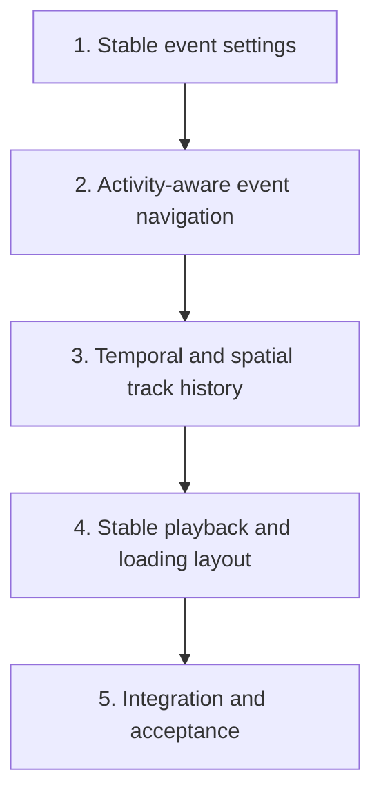

# Focus Review History and Event Ergonomics Plan

Date: 2026-09-03

Status: Approved for Beads implementation tracking

Origin:

- User review feedback recorded on 2026-09-03.
- `docs/brainstorms/2026-09-02-web-track-visualization-requirements.md`
- `track-viz/docs/plans/2026-09-02-web-track-visualization.md`
- `track-viz/docs/HANDOFF.md`

## Accepted User Feedback

- Leave the current long source-path presentation unchanged.
- Keep the Explore-mode `B` shortcut unchanged; it reveals all current-frame boxes.
- Replace the endpoint-only timeline with an immediately readable history that
  exposes intermediate track evidence and supports intermediate seeking.
- Correct displacement, scale, and proximity review navigation so Next activity
  does not behave like unexplained one-frame stepping and disabled states are clear.
- Show how the selected object moved through its past history, with an optional
  complete-history view.
- Prevent transient playback/loading notices from moving the Focus timeline,
  filmstrip, or lower panels.

## Goal

Make Focus review stable and immediately understandable during tracker inspection.
The reviewer should be able to see when a selected track exists, where the
current frame lies within its lifetime, how the object moved, and where meaningful
review activities occur without controls disappearing or the lower UI shifting
during playback.

## Confirmed Baseline

- Holding `B` in Explore mode temporarily reveals every current-frame box.
  Hover remains the local candidate preview. This behavior is accepted and will
  not change in this work.
- Long source-path presentation is accepted and will not change in this work.
- `TrackTimeline` currently renders only first observation, last observation,
  gap starts, and enabled-event frames. A continuous track with events disabled
  therefore shows only two endpoint markers.
- The filmstrip, rather than the timeline rail, currently provides intermediate
  clickable observations.
- All enabled event families are merged into one frame list for Previous/Next
  enabled-event navigation.
- Changing an event checkbox or threshold reloads track evidence, the filmstrip,
  and event data, temporarily replacing the complete Focus panel with a loading
  message.
- A normal user edit of a decimal threshold can be interrupted after the first
  keystroke by that reload. In the observed `MOT20-01` track 72 case, typing
  `0.02` committed `0`, causing displacement or scale events on every transition
  and making Next event advance from frame 404 to 405.
- Close-interaction evidence can legitimately cover every observation in a
  crowded scene under the current edge-proximity definition. Raw event density
  must not be confused with navigation correctness.
- The exact-frame and observation-loading messages inside the viewport are
  already positioned as overlays. The Context loading status is in normal page
  flow, and the Focus panel is unmounted during event-setting reloads; both can
  move the timeline and filmstrip.

## Product Decisions and Assumptions

These decisions are the working interpretation of the accepted user feedback:

1. The temporal rail remains sequence-wide so the reviewer can immediately see
   where the selected track begins and ends within the complete sequence.
2. The rail shows observed runs, missing-frame gaps, a current-frame playhead,
   endpoints, and event/activity markers. The rail itself is seekable at
   intermediate positions; the filmstrip remains the crop-oriented evidence view.
3. The on-frame trajectory defaults to past-through-current evidence. An explicit
   control may show the complete track, with future evidence visually distinct.
4. Trajectory lines break at observation gaps and never imply motion through
   missing evidence.
5. Raw detector results remain available, but persistent family-specific
   Previous/Next activity controls navigate meaningful episodes for displacement,
   scale, and proximity rather than an unexplained union of every flagged frame.
   Low-confidence evidence has separate navigation and is never silently mixed
   into those three families.
6. Event settings remain visible while updates are in flight. Threshold text is
   edited locally, committed after 300 milliseconds of inactivity, and committed
   immediately on Enter or blur rather than causing a full Focus reload on every
   keystroke.
7. Temporary loading and buffering feedback must not change the geometry of the
   viewport, Focus controls, timeline, or filmstrip.
8. Event thresholds use the backend's finite inclusive range `0..100`. Invalid
   drafts issue no request; a backend validation response such as HTTP 422 restores
   the last successful settings and produces a non-layout-shifting accessible error.

## Scope

### In scope

- Stable event checkbox and decimal-threshold editing.
- Event-only refreshes with stale-request cancellation and visible updating state.
- Family-specific event counts, activity grouping, navigation, and disabled reasons.
- An observation-rich, clickable sequence-wide track timeline.
- A current-frame playhead and collision-safe event/gap markers.
- Past and complete spatial trajectory modes with gap-aware line segments.
- Non-layout-shifting loading/buffering indicators during playback and review updates.
- Characterization-first unit, browser, and real-data verification.
- Operator documentation for the revised controls and semantics.

### Out of scope

- Source-path display changes.
- Changes to the Explore-mode `B` shortcut.
- Track editing, annotation decisions, split/merge/relabel operations, or persistence.
- Inferring identities for sentinel-only tracker results.
- Changing raw datasets, ground truth, predictions, or source identifiers.
- ReID, model training, tracker evaluation, or benchmark claims.
- Changing detector mathematics merely to make events less frequent without
  characterization evidence and explicit review.

## Invariants

- Frames remain one-based and seek the exact enumerated JPEG.
- Source, row, frame, and sequence-local track identities remain unchanged.
- Dataset and annotation files remain read-only.
- Disabled heuristic families contribute no navigation targets.
- Raw event payloads remain auditable even when the UI groups them into episodes.
- A missing frame is rendered as missing evidence, not interpolated truth.
- Ground-truth visibility is not relabeled as tracker confidence.
- Accessibility cannot depend on color alone; every marker and disabled state has
  a text or accessible-name explanation.

## Implementation Tasks

### Task 1: Stabilize Focus event settings and refresh lifecycle

**Type/Priority:** bug, P1

**Objective:** Prevent event controls from disappearing, losing decimal input, or
unnecessarily reloading independent track evidence.

**Primary paths:**

- `track-viz/web/src/App.tsx`
- `track-viz/web/src/FocusReview.tsx`
- `track-viz/web/src/api.ts`
- `track-viz/web/src/App.test.tsx`
- `track-viz/web/src/FocusReview.test.tsx`
- focused Playwright coverage under `track-viz/web/e2e/`

**Work:**

- Characterize the current threshold-typing failure before changing behavior.
- Separate stable track evidence/filmstrip loading from event-settings refreshes.
- Keep the last valid Focus content mounted while event data updates.
- Give number inputs local draft text so intermediate values such as an empty
  field, `0`, `0.`, and `0.02` do not cause destructive rerenders.
- Commit validated thresholds after a 300 millisecond debounce, or immediately
  on Enter or blur; cancel stale requests and ensure the newest settings win.
- Treat empty, incomplete, non-finite, and out-of-range drafts as invalid without
  issuing a request. On blur, revert an invalid draft to the last successful
  value and announce the validation reason.
- If an event refresh fails, retain the last successful event data and settings,
  restore the controls to those settings, and show a non-layout-shifting error
  with a retry action.
- Task 1 owns only event-refresh mount invariance and the event-settings status
  slot. Playback image, observation, and per-frame Context layout invariance belongs
  to Task 4.
- Preserve checkbox combinations across sequential and rapid interaction.
- Show a small updating state without disabling unrelated controls.

**Acceptance:** Typing `0.02` character by character leaves the value at `0.02`;
the timeline and filmstrip remain mounted; the existing combined next-event action
seeks the exact frame derived by the synthetic characterization fixture; only
event data is refreshed; and the latest combination of all three event families
is retained.

### Task 2: Make review-event navigation activity-aware

**Type/Priority:** feature, P1

**Depends on:** Task 1

**Objective:** Make Previous/Next actions correspond to understandable activities
for each event family rather than an opaque union of dense event frames.

**Primary paths:**

- `track-viz/src/mot20/viewer/events.py` (inspect only unless characterization
  proves a separately approved backend defect)
- `track-viz/tests/viewer/test_events.py` (characterization tests only)
- `track-viz/web/src/focusNavigation.ts`
- a new pure event-episode module if warranted
- `track-viz/web/src/FocusReview.tsx`
- `track-viz/web/src/TrackTimeline.tsx`
- adjacent frontend tests

**Work:**

- Add characterization coverage for displacement, scale, and close-interaction
  density, including exact threshold boundaries and contiguous flagged frames.
- Derive family-specific activity episodes in a pure frontend module while
  preserving the backend raw-event payload and API contract.
- Consecutive displacement or scale flags form one run only when their observation
  transitions are contiguous. A raw event spanning a missing-observation gap is
  a standalone activity and activities never merge across a gap. The anchor is
  the greatest normalized severity, with the earliest anchor frame winning ties.
- Consecutive close-interaction frames form one activity per competitor. The
  anchor is the smallest normalized edge distance, with earliest frame and then
  lowest competitor ID breaking ties. Show both activity count and raw-match count.
- Give displacement, scale, and proximity persistent family-specific counts and
  Previous/Next activity controls. Unavailable actions remain visible but gray
  and disabled, with both visible and accessible reasons. Do not silently mix
  families.
- When the current frame lies inside an activity, Previous/Next skips that activity
  and moves to the preceding/following activity anchor. Concurrent activities at
  the same anchor frame are all exposed in the current-frame detail even though
  seeking deduplicates the destination frame.
- Give meaningful low-confidence observations their own navigation controls and
  count; navigate their exact individual frames rather than grouping them into
  heuristic episodes. When confidence is unavailable, surface the backend's
  existing absent, sentinel, or constant diagnostic rather than inventing a new
  reason. Remove low confidence from the optional-event navigation union.
- Remove the existing combined Previous/Next enabled-event controls and update
  their unit and browser assertions; the explicit family controls replace them.
- State why navigation is disabled: family off, no matching activity, no previous
  activity, or no next activity.
- Use family-aware density warnings. A zero displacement or scale threshold
  necessarily matches every valid transition because those operators are `>=`.
  A zero proximity threshold matches touching or overlapping boxes whose edge
  distance is zero and can therefore still be dense. Do not silently alter the
  requested threshold.
- Close-interaction activities require the typed usable competitor ID already
  present in the backend response. Sentinel-only sources expose no track-event
  controls because their track capability is unavailable.
- Ensure timeline markers reveal family, range, anchor frame, and severity.

**Acceptance:** On a deterministic synthetic fixture, displacement at `0.02`
navigates to the fixture-derived activity anchor rather than the next ordinary
frame; the raw-next frame and grouped-activity anchor are asserted independently
and may differ. Scale at its default threshold reports no next activity and
explains why; proximity covering a continuous per-competitor run navigates as one
understandable activity; and every unavailable action remains visible with a
deterministic visible and accessible reason. A separate real-data smoke records
the observed `MOT20-01` track 72 behavior without making it a deterministic gate.

### Task 3: Build temporal and spatial track-history visualization

**Type/Priority:** feature, P1

**Depends on:** Task 2

**Objective:** Turn the bottom rail and viewport trajectory into complementary,
immediate summaries of when the selected track exists and how it moved.

**Primary paths:**

- `track-viz/web/src/TrackTimeline.tsx`
- a new pure timeline-plan module if warranted
- `track-viz/web/src/focusOverlayPlan.ts`
- `track-viz/web/src/FrameViewport.tsx`
- `track-viz/web/src/FocusReview.tsx`
- `track-viz/web/src/styles.css`
- `track-viz/web/src/FocusReview.test.tsx`
- adjacent overlay-plan tests
- focused Playwright coverage under `track-viz/web/e2e/`

**Work:**

- Render a sequence-wide base rail and a clearly highlighted selected-track
  lifetime from first through last observation.
- Convert exact observation frames into occupied runs; render gaps as explicit
  breaks rather than a single unqualified line.
- Add a stable current-frame playhead, including when the current frame is inside
  a gap or outside the track lifetime.
- Keep endpoint, gap, confidence, and event/activity markers visually and
  semantically distinct. Stack or lane colliding markers so the last-observation
  control remains usable.
- Make the rail itself pointer- and keyboard-seekable at intermediate frames.
- Implement the rail as one accessible range-style control with `aria-valuemin=1`,
  `aria-valuemax=frameCount`, and the exact current frame as its value. Arrow keys
  seek one frame, Shift+Arrow seeks ten, and Home/End seek sequence bounds.
- Render event/activity glyphs as non-focusable rail evidence and retain explicit
  family navigation for accessible event traversal. Bound rendered glyphs to 256;
  above that, deterministically aggregate them into temporal bins while preserving
  the nearest previous/next activity, endpoints, and the current-frame bin.
- Retain the filmstrip for crop evidence instead of duplicating it in the rail.
- Retain past-through-current trajectory as the default evidence-safe view.
- Add an explicit complete-track option; distinguish future points/segments from
  already observed history.
- Break trajectory geometry at every evidence gap.
- Use direction, age, stroke, or opacity cues without making color the only cue.
- Keep the current box and identity visually dominant in Focus and Context modes.
- Apply deterministic trajectory decimation with at most 512 rendered vertices,
  preserving first, last, current, and gap-boundary evidence. If mandatory gap
  boundaries exceed the budget, render bounded unconnected evidence markers and
  disclose that the path was simplified rather than reconnecting gaps.
- Preserve the static trajectory under `prefers-reduced-motion`; suppress only
  animated transitions or motion effects.
- Write failing pure timeline and trajectory-plan tests first, covering short and
  long tracks, gaps, marker collisions, exact pointer rounding, intermediate
  keyboard seeking, and deterministic decimation.

**Acceptance:** A continuous track visibly contains intermediate observations;
a gapped track shows occupied runs separated by exact missing ranges; the current
frame is always evident; every reachable frame/marker seeks the correct one-based
source frame without marker overlap blocking another action; the default
trajectory contains no future frames; complete-track mode is unmistakably
different; and gaps never receive connecting lines.

### Task 4: Eliminate playback and loading layout shifts

**Type/Priority:** bug, P1

**Depends on:** Task 3

**Objective:** Keep the viewport, timeline, filmstrip, and lower controls fixed
while playback image decoding, observations, or per-frame Context evidence are
loading. Task 1 already owns event-refresh mount/status-slot invariance; Task 4
owns playback and cross-panel geometry.

**Primary paths:**

- `track-viz/web/src/App.tsx`
- `track-viz/web/src/FrameViewport.tsx`
- `track-viz/web/src/FocusReview.tsx`
- `track-viz/web/src/styles.css`
- `track-viz/web/e2e/tracer.spec.ts`
- `track-viz/web/e2e/real.spec.ts`

**Work:**

- Write a failing delayed-playback layout characterization before implementation.
- Reproduce delayed image decoding, observation responses, per-frame Context
  responses, and their failure states separately. Retain one integration check
  that Task 1's event-refresh slot does not disturb the final layout.
- Keep transient statuses inside a positioned overlay or a permanently reserved
  status slot with invariant dimensions.
- Do not unmount the Focus review structure during background refreshes.
- Preserve accessible `status` announcements without adding normal-flow height.
- Add desktop and narrow Playwright layout-stability assertions comparing the
  Focus panel, viewport, timeline, filmstrip, and subsequent lower-panel bounding
  boxes before, during, and after delayed or failed responses.

**Acceptance:** During continuous Focus/Context playback with injected network
delays, the timeline and filmstrip move by no more than one CSS pixel and controls
remain operable unless their own action is genuinely unavailable.

### Task 5: Integrate, document, and obtain browser acceptance

**Type/Priority:** task, P1

**Depends on:** Tasks 1 through 4

**Objective:** Verify the improvements as one coherent review workflow and update
the operator contract.

**Primary paths:**

- cross-feature tests under `track-viz/web/src/` and `track-viz/web/e2e/`
- `track-viz/README.md`
- `track-viz/docs/HANDOFF.md`
- `track-viz/docs/performance.md` only if measured evidence changes

**Work:**

- Exercise every event family alone, every pair, and all three together.
- Exercise threshold keyboard entry, checkbox changes during requests, beginning,
  middle, end, gap, and no-event states.
- Exercise past and complete trajectory modes and timeline seeking.
- Run deterministic desktop and narrow Playwright coverage with delayed requests,
  console/network checks, accessibility scans covering the range-style rail and
  all family event controls, and screenshots.
- Run a read-only real-data journey on `MOT20-01` track 72 plus a synthetic gapped
  and event-sparse track. Record the observed raw next displacement frame at
  threshold `0.02` separately from any grouped activity anchor. Preserve
  before/after source manifests.
- Compare fresh pointer-latency and cache evidence with
  `track-viz/artifacts/verification/browser-performance.json`; retain the existing
  p95-under-50-ms requirement or explicitly document why a measurement is not
  affected. Update `performance.md` whenever the measured evidence changes.
- Update control descriptions and known limitations, including raw-event versus
  activity-episode semantics.
- Present screenshots and the running UI for user visual acceptance before
  closing the epic.

**Acceptance:** All focused and aggregate viewer gates pass; source manifests are
unchanged; new controls have zero serious/critical axe violations; pointer-latency
evidence remains within the accepted budget; browser screenshots show stable
geometry; and the user accepts the timeline, trajectory, event navigation, and
playback behavior.

## Dependency Graph



The children execute serially because they intentionally revise the same Focus
review surface. Task 2 requires Task 1's stable settings contract. Task 3 requires
Task 2's final activity representation so the timeline is not redesigned twice.
Task 4 validates layout against the final controls and history geometry from Task
3. This order prevents concurrent ownership of `App.tsx`, `FocusReview.tsx`,
`TrackTimeline.tsx`, shared styles, and browser specifications.

## Tracer Bullet

Start with Task 1 and one deterministic synthetic browser test:

1. Create a tracked synthetic sequence containing ordinary transitions and a
   known displacement event at a later fixture-defined frame.
2. Enter Focus on that synthetic track and enable abrupt displacement.
3. Type `0.02` one character at a time.
4. Delay the event response.
5. Assert the Focus panel, timeline, and filmstrip remain in place.
6. Assert the committed threshold is `0.02` and the existing Next enabled-event
   action seeks the exact fixture-defined event frame rather than the next
   ordinary frame.

Task 2 then replaces that combined action with the three explicit activity
navigators and adds its family-specific episode assertions.

This proves the state, request, layout, and navigation path before the broader
visual redesign.

## Verification

Focused checks during implementation:

```bash
npm --prefix track-viz/web run test
npm --prefix track-viz/web run typecheck
.venv/bin/python -m pytest -c track-viz/pyproject.toml -m "not local_data" track-viz/tests/viewer
PLAYWRIGHT_BROWSERS_PATH="$PWD/track-viz/web/.playwright" npm --prefix track-viz/web run e2e
```

Final gates:

```bash
make test
make lint
make build
make e2e
make smoke-local
make pip-check
make acceptance
make e2e-real
```

`make e2e-real` remains an explicit local-data gate. Compare source manifests
before making any completion claim.

## Risks and Mitigations

- **Event grouping hides evidence:** Preserve raw events, expose episode ranges and
  representative anchors, and keep exact frames inspectable.
- **Timeline becomes visually dense:** Use occupied runs and marker lanes rather
  than one control per observation; verify dense and short tracks at both viewport
  widths.
- **Sequence-wide scale compresses short tracks:** Preserve exact seeking and add
  accessible labels/hit targets; if observed review still fails, handle track-life
  zoom as separately approved follow-up rather than silently changing the scale.
- **Full trajectory implies future knowledge:** Default to past-only and visibly
  distinguish complete-track future evidence.
- **Request races restore stale settings:** Cancel stale requests and test that the
  newest local settings are authoritative.
- **Loading overlays obscure evidence:** Keep overlays small, non-interactive, and
  positioned away from primary controls; test keyboard and screen-reader status.
- **Real-data overfitting:** Use real track 72 only as a read-only usability check;
  retain synthetic gapped, sparse-event, and dense-event fixtures for deterministic
  correctness.

## Beads Structure

Create one P1 epic titled **Improve Focus track history and event review** with
this document as its specification. Create Tasks 1 through 5 as flat children.
Add only the blocking dependencies shown in the graph. Do not claim any child
during planning, and do not commit or sync Beads without explicit authorization.

## Plan Review Record

Reviewer: Codex Sol plan-review subagent

Verdict: **APPROVE WITH CHANGES**

Material changes incorporated before issue creation:

- Made displacement, scale, and proximity navigation persistent and
  family-specific, with visible/accessibility-complete disabled reasons.
- Defined frontend-derived episode boundaries, anchors, tie-breaking, behavior
  inside an activity, raw versus activity counts, and separate low-confidence
  navigation.
- Selected a 300 millisecond threshold commit policy with immediate Enter/blur,
  invalid-draft rollback, and failed-refresh rollback.
- Corrected the tracer bullet to assert the existing Task 1 navigation target at
  exact frame 409; family-specific assertions begin in Task 2.
- Merged temporal and spatial history into one child and made all five children
  serial to eliminate shared-file ownership conflicts.
- Added deterministic trajectory decimation, static reduced-motion behavior,
  test-first requirements, narrow/desktop geometry checks, and loading failure
  coverage.

Final review status: **APPROVED FOR BEADS CREATION**

### Copilot CLI Opus 5 review

- Reviewer: GitHub Copilot CLI 1.0.82, `claude-opus-5`, medium reasoning effort
- Verdict: **APPROVE WITH CHANGES**
- Blocking findings resolved: deterministic versus real-data fixture separation;
  removal of hard-coded real frame 409 from deterministic acceptance; and explicit
  Task 1 versus Task 4 layout ownership.
- Additional resolutions: backend-mirrored threshold bounds and 422 handling;
  per-family density warnings; exact low-confidence semantics; removal of the
  combined event navigator; characterization-only backend scope; range-style rail
  keyboard semantics; a 256-glyph timeline budget; axe coverage; and explicit
  browser-performance comparison.
- Beads verdict: retain the existing epic and children, updating them in place.

Final review status after both independent passes: **APPROVED FOR EXECUTION**
